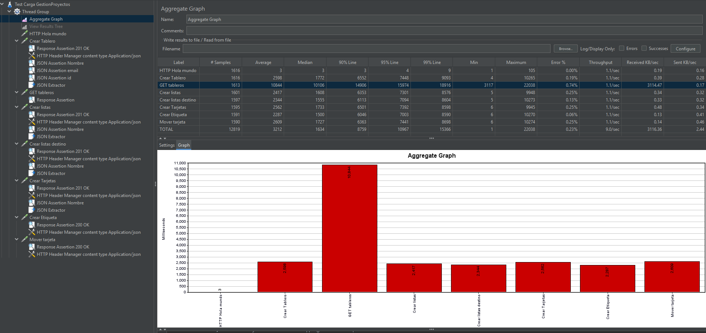
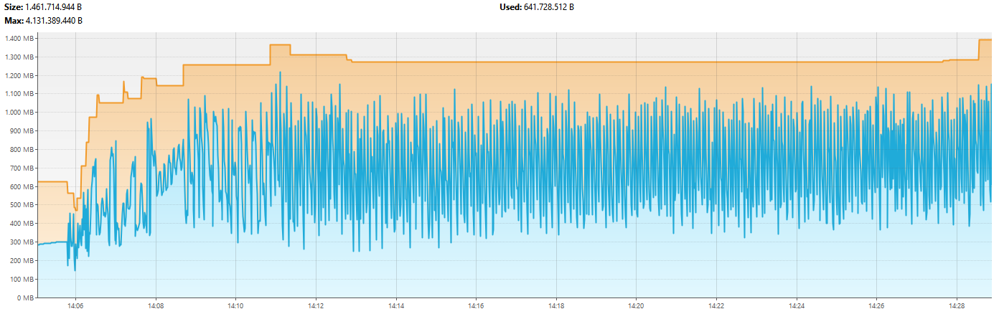
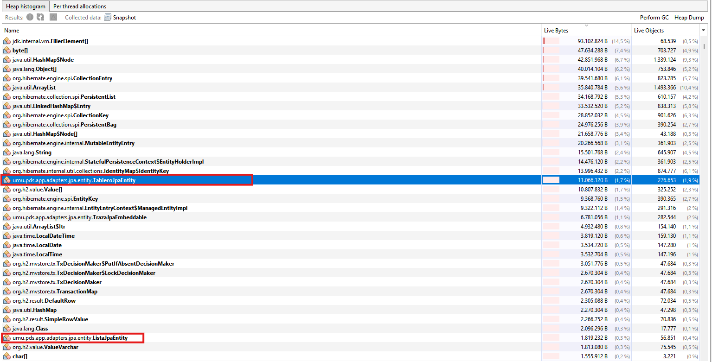

# Analisis del test de carga

Este documento resume la informacion obtenida a partir de los ficheros incluidos en este directorio:

- `TestCargaBack.jmx`: plan de prueba de JMeter.
- `statistics.csv`: resultados agregados del test.
- `heapdump-1777984258407.hprof`: volcado de memoria generado durante la prueba.
- `img/jmeterestadisticas.png`: captura de las estadisticas agregadas en JMeter.
- `img/Aggregate Graph.png`: grafica agregada de tiempos medios.
- `img/rendimiento.png`: evolucion del uso de memoria durante la ejecucion.
- `img/rendimientoobjetosmemoria.png`: histograma de objetos vivos en memoria.

## Configuracion de la prueba

La prueba definida en `TestCargaBack.jmx` se llama **Test Carga GestionProyectos** y fue ejecutada contra la aplicacion en local:

- Host: `localhost`
- Puerto: `8080`
- Numero de hilos: `30`
- Ramp-up: `100` segundos
- Iteraciones: indefinidas (`LoopController.loops = -1`)
- Politica ante error: continuar
- Duracion observada: aproximadamente 20 minutos

El escenario simula un flujo completo de uso de la aplicacion, creando y consultando datos de forma continua. En cada iteracion se ejecutan estas operaciones:

1. `GET /umu/pds/public/holaMundo`
2. `POST /umu/pds/tableros`
3. `GET /umu/pds/tableros?email=correo@test.um.es`
4. `POST /umu/pds/tableros/${idTablero}/listas`
5. `POST /umu/pds/tableros/${idTablero}/listas`
6. `POST /umu/pds/tableros/${idTablero}/listas/${listaId}/tarjetas`
7. `POST /umu/pds/tableros/${idTablero}/listas/${listaId}/tarjetas/${idTarjeta}/etiquetas`
8. `POST /umu/pds/tableros/${idTablero}/tarjetas/mover`

El test va encadenando las respuestas mediante extractores JSON. Por ejemplo, se extrae `idTablero`, `listaId`, `listaId2` e `idTarjeta` para usarlos en las peticiones siguientes. Esto hace que el test no sea una simple repeticion aislada, sino una carga acumulativa que crea tableros, listas, tarjetas y etiquetas reales durante toda la ejecucion.

## Resultados agregados de JMeter

Los datos de `statistics.csv` corresponden al informe agregado de JMeter. Las columnas usadas son las habituales del Aggregate Report: numero de muestras, media, mediana, percentiles, minimo, maximo, porcentaje de error, throughput y trafico recibido/enviado.

| Operacion | Muestras | Media | Mediana | P90 | P95 | P99 | Min | Max | Error | Throughput |
| --- | ---: | ---: | ---: | ---: | ---: | ---: | ---: | ---: | ---: | ---: |
| HTTP Hola mundo | 1616 | 3 ms | 3 ms | 3 ms | 4 ms | 9 ms | 1 ms | 105 ms | 0.000% | 1.14286/s |
| Crear Tablero | 1616 | 2598 ms | 1772 ms | 6552 ms | 7448 ms | 9093 ms | 4 ms | 10265 ms | 0.186% | 1.13695/s |
| GET tableros | 1613 | 10844 ms | 10106 ms | 14906 ms | 15974 ms | 18916 ms | 3117 ms | 22038 ms | 0.744% | 1.13486/s |
| Crear listas | 1601 | 2417 ms | 1608 ms | 6353 ms | 7301 ms | 8576 ms | 5 ms | 9948 ms | 0.250% | 1.12929/s |
| Crear listas destino | 1597 | 2344 ms | 1555 ms | 6113 ms | 7094 ms | 8604 ms | 5 ms | 10273 ms | 0.125% | 1.12649/s |
| Crear Tarjetas | 1595 | 2562 ms | 1733 ms | 6501 ms | 7392 ms | 8598 ms | 6 ms | 9945 ms | 0.251% | 1.12509/s |
| Crear Etiqueta | 1591 | 2287 ms | 1500 ms | 6046 ms | 7003 ms | 8590 ms | 6 ms | 10270 ms | 0.063% | 1.12228/s |
| Mover tarjeta | 1590 | 2609 ms | 1727 ms | 6363 ms | 7441 ms | 8698 ms | 6 ms | 10274 ms | 0.252% | 1.12159/s |
| TOTAL | 12819 | 3212 ms | 1634 ms | 8759 ms | 10967 ms | 15366 ms | 1 ms | 22038 ms | 0.234% | 9.01873/s |

## Analisis de rendimiento

El endpoint mas rapido es claramente `HTTP Hola mundo`, con una media de 3 ms y sin errores. Esto indica que la aplicacion responde correctamente cuando la operacion no implica carga de datos ni trabajo de persistencia relevante.

El principal cuello de botella es `GET tableros`, con una media de **10844 ms**, una mediana de **10106 ms** y un maximo de **22038 ms**. Tambien es la operacion con mayor porcentaje de error, **0.744%**. Esta diferencia respecto al resto de operaciones es importante: mientras las operaciones de creacion se mueven aproximadamente entre 2.2 y 2.6 segundos de media, la consulta de tableros tarda mas de 10 segundos de media.

Esto encaja con el comportamiento esperado del test: se estan creando muchos objetos continuamente y despues se vuelven a cargar mediante la consulta de tableros. A medida que avanza la prueba, la cantidad de informacion asociada al usuario `correo@test.um.es` crece rapidamente. Por tanto, cada `GET tableros` tiene que recuperar un volumen cada vez mayor de entidades y relaciones, lo que incrementa tanto el tiempo de respuesta como la presion sobre memoria.

El total del test muestra:

- **12819 muestras** ejecutadas.
- **3212 ms** de tiempo medio global.
- **1634 ms** de mediana global.
- **0.234%** de errores totales.
- **9.01873 peticiones por segundo** de throughput agregado.

El porcentaje de error global es bajo, por lo que no parece que la aplicacion este fallando masivamente bajo esta carga. Sin embargo, los tiempos de respuesta son elevados, especialmente en lecturas acumulativas como `GET tableros`.

## Analisis de memoria

La captura `rendimiento.png` muestra que durante la ejecucion el uso de memoria sube rapidamente y despues se mantiene con oscilaciones frecuentes. El test duro aproximadamente 20 minutos y el uso de memoria se mantiene medianamente estable, en torno a los **900 MB**, aunque con picos y bajadas producidas por la actividad del recolector de basura.

Aunque el consumo se estabiliza relativamente, sigue siendo un uso alto de memoria. Lo esperado seria que la aplicacion se mantuviera mas cerca de **500 MB**, pero escala muy rapido por la naturaleza del test: se crean muchos objetos y despues se cargan todos otra vez mediante las consultas. Esto provoca que la memoria se llene continuamente y que el recolector de basura tenga que trabajar de forma constante.

La forma de la grafica es relevante:

- Al inicio la memoria usada esta alrededor de unos cientos de MB.
- Tras comenzar la carga, el uso sube con fuerza.
- Despues aparecen dientes de sierra continuos: la memoria sube al cargar objetos y baja cuando actua el GC.
- No se aprecia un crecimiento infinito durante la ventana observada, por lo que con esta evidencia no se puede afirmar una fuga de memoria clara.
- Si se aprecia una presion de memoria alta y sostenida.

## Analisis del heap dump

El fichero `heapdump-1777984258407.hprof` ocupa aproximadamente **82 MB**. La captura `rendimientoobjetosmemoria.png` muestra el histograma de objetos vivos en memoria.

En el histograma aparecen muchos objetos de infraestructura de Java, Hibernate y H2, como:

- `java.util.HashMap$Node`
- `java.lang.Object[]`
- `org.hibernate.engine.spi.CollectionEntry`
- `java.util.ArrayList`
- `org.hibernate.collection.spi.PersistentList`
- `org.hibernate.collection.spi.PersistentBag`
- `org.hibernate.engine.spi.EntityKey`
- `org.h2.value.Value...`

Tambien aparecen objetos propios de la aplicacion, entre ellos:

- `umu.pds.app.adapters.jpa.entity.TableroJpaEntity`
- `umu.pds.app.adapters.jpa.entity.TrazalpaEmbeddable`
- `umu.pds.app.adapters.jpa.entity.ListaJpaEntity`

La aparicion de objetos propios en memoria es esperable en este escenario. El test crea una gran cantidad de tableros, listas, tarjetas y etiquetas, y despues los vuelve a recuperar. Por tanto, Hibernate tiene que materializar muchas entidades, colecciones y estructuras auxiliares para representar esas relaciones.

El caso mas llamativo de la captura es `TableroJpaEntity`, que aparece resaltado con:

- **11.066.120 bytes vivos**
- **276.653 objetos vivos**

Esto confirma que hay una cantidad muy elevada de entidades propias cargadas en memoria. Tambien aparecen muchas colecciones persistentes de Hibernate, lo que sugiere que las relaciones entre entidades estan teniendo un peso importante en el consumo total.

## Diagnostico

El comportamiento observado es coherente con una prueba de carga acumulativa:

- Se crean objetos continuamente.
- Esos objetos quedan persistidos.
- Las consultas posteriores vuelven a cargar una cantidad cada vez mayor de datos.
- Hibernate materializa entidades, colecciones y estructuras internas.
- La memoria se llena con frecuencia y el GC libera parte de ella, generando oscilaciones constantes.

Por tanto, el consumo alto de memoria no parece anormal para este escenario concreto, pero si indica que la aplicacion escala muy rapido en memoria cuando se cargan muchos datos relacionados. El objetivo deseable seria reducir el consumo hacia unos **500 MB**, pero en esta prueba se mantiene mas cerca de **900 MB** debido al volumen de objetos creados y recargados.

No se puede concluir solo con esta prueba que exista una fuga de memoria. Para afirmar eso seria necesario ejecutar una prueba mas larga o comparar varios heap dumps en distintos momentos, comprobando si el numero de entidades retenidas crece indefinidamente incluso despues de GC. Lo que si se puede afirmar es que existe una presion de memoria considerable y que las consultas que cargan muchos datos tienen un impacto directo en el rendimiento.

## Conclusiones

- La aplicacion soporta la carga sin un porcentaje alto de errores: el total de errores es **0.234%**.
- El throughput agregado es de unas **9 peticiones por segundo**.
- El endpoint mas problematico es `GET tableros`, con mas de **10 segundos de media**.
- El consumo de memoria se mantiene medianamente estable durante unos 20 minutos, pero alrededor de **900 MB**, por encima del objetivo deseado de **500 MB**.
- Aparecen muchos objetos propios en memoria, especialmente entidades JPA, lo que confirma que la carga de datos creados durante el test ocupa mucho espacio.
- El comportamiento es normal para un test que crea muchos objetos y despues los carga repetidamente, pero revela un problema de escalabilidad en memoria y en consultas acumulativas.

## Posibles mejoras

Para reducir el consumo de memoria y mejorar los tiempos de respuesta se deberia revisar especialmente el endpoint `GET tableros`:

- Aplicar paginacion o limites en la consulta de tableros.
- Evitar cargar relaciones completas si no son necesarias para la respuesta.
- Revisar estrategias `EAGER`/`LAZY` en las entidades JPA.
- Usar DTOs o proyecciones para devolver solo los campos necesarios.
- Comprobar si las colecciones de Hibernate se estan inicializando de forma innecesaria.
- Ejecutar una prueba adicional con datos ya precargados para separar el coste de creacion del coste de lectura.
- Repetir la prueba durante mas tiempo y comparar heap dumps antes y despues de forzar GC.

En resumen, el test muestra que la aplicacion no colapsa durante la ventana analizada, pero el consumo de memoria y el endpoint `GET tableros` deben considerarse los principales puntos de mejora.
